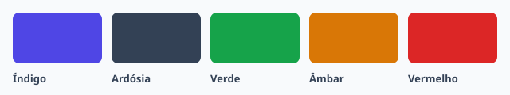

## Paleta base

| Cor | Token | Uso |
| --- | --- | --- |
| Índigo | `--acme-primary` | Ação principal, links e foco |
| Ardósia | `--acme-neutral` | Texto, bordas e superfícies |
| Verde | `--acme-success` | Confirmação e estados positivos |
| Âmbar | `--acme-warning` | Atenção, sem bloquear |
| Vermelho | `--acme-danger` | Erros e ações **destrutivas** |

## Contraste

Todo texto sobre cor precisa de contraste mínimo de *4,5:1* (WCAG AA). Os pares aprovados estão em [Tokens › Uso](./tokens/usage.mdx).

<Callout variant="tip">
  Prefira sempre o token ao valor hexadecimal: o tema escuro troca o valor, não o nome.
</Callout>
